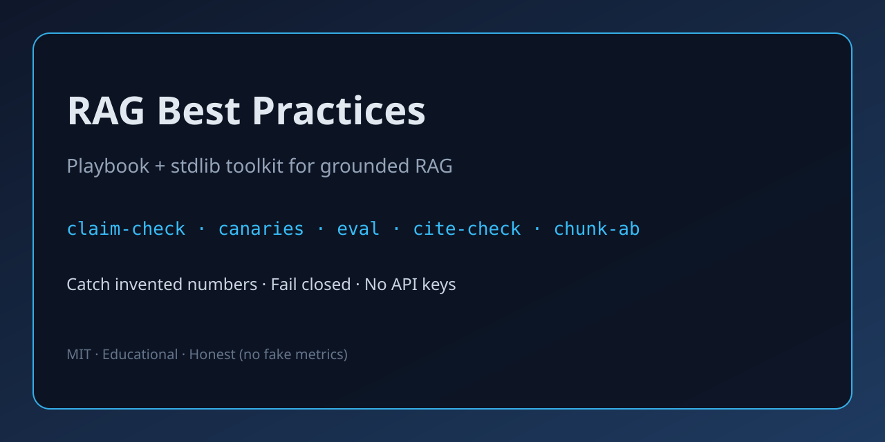

# RAG Best Practices

[](LICENSE)
[](https://github.com/grigortodorov/rag-best-practices/actions/workflows/ci.yml)
[](https://www.python.org/downloads/)
[](docs/13-toolkit.md)

<p align="center">
  
</p>

**Catch RAG hallucinations before users do.** Educational playbook + a tiny stdlib Python toolkit (`ragpractices`) for chunking, hybrid retrieval, eval gates, citations, and claim-level faithfulness — no API keys, no fake metrics.

If this helps your next RAG design review, a ⭐ makes it easier for others to find.

## Why this repo

Most RAG writeups stop at “embed → retrieve → prompt.” Shipping teams need the boring parts that prevent invented numbers, silent index drift, and fluent-but-wrong answers.

| You need… | This repo gives you… |
| --- | --- |
| Principles you can argue in a design review | 13 focused docs + anti-patterns |
| Something to run in CI today | `eval`, `canary`, `claim-check`, `conflict-check` (exit codes) |
| Anti-hallucination beyond “looks grounded” | Claim support + hard number/date/id checks |
| No vendor lock-in | MIT, stdlib-only toolkit |

Honest scope: educational heuristics and stubs — **not** production NLI, and **no** fabricated stars, downloads, or eligibility claims.

## 60-second demo (hallucinated number)

```bash
pip install -e .
# Source says "30 days" — invented "99" → abstain (exit 1)
ragpractices claim-check \
  --answer "Refunds are accepted within 99 days of purchase." \
  --sources examples/hybrid-docs.txt
```

```text
decision: abstain
reasons: missing entities: 99
  [supported] overlap=0.67 <- doc-0: Refunds are accepted within 99 days of purchase.
missing:
  - number: 99
```


Same wording with `30` → `decision: pass`. That is the niche: **prose can look fine while a number is fabricated**.

The checked-in [passing answer](examples/claim-check-pass.txt) and
[failing answer](examples/claim-check-fail.txt) differ only in that number.
Run either file against the same [sources](examples/hybrid-docs.txt), from the
repository root:

```bash
# Source-backed 30 days: decision pass, exit 0
ragpractices claim-check --answer examples/claim-check-pass.txt --sources examples/hybrid-docs.txt
# Invented 99 days: decision abstain, exit 1 (expected)
ragpractices claim-check --answer examples/claim-check-fail.txt --sources examples/hybrid-docs.txt
```

This isolates a generation error: the correct refund policy is already in the
supplied sources. It does not demonstrate retrieval quality or general factual
entailment.

Pre-answer source clash (30 vs 90 day refund windows):

```bash
ragpractices conflict-check --sources examples/conflict-docs.jsonl
# → decision: conflict (exit 1)
```

Index drift probe (also in CI):

```bash
ragpractices canary --canaries examples/canaries.jsonl --docs examples/acl-docs.jsonl --k 3
# → canaries: 7/7 passed
```

## Quick start

```bash
git clone https://github.com/grigortodorov/rag-best-practices.git
cd rag-best-practices
pip install -e .
ragpractices --help
ragpractices demo --query "refund shipping"
ragpractices eval --golden examples/golden-retrieval.jsonl --docs examples/hybrid-docs.txt --k 3 --min-hit-rate 0.6
```

Full command list: [docs/13-toolkit.md](docs/13-toolkit.md).

### Popular toolkit commands

| Command | What it catches / does |
| --- | --- |
| `claim-check` | Per-claim support + invented numbers/dates/ids |
| `conflict-check` | Pre-answer source disagreements (numbers / negation) |
| `cite-check` | Quoted spans and `[n]` markers vs sources |
| `canary` | Index drift / ACL probe suite (CI gate) |
| `eval` | Offline hit@k / MRR with `--min-hit-rate` |
| `chunk-ab` | Compare chunkers on the same golden queries |
| `position-stress` | Lost-in-the-middle packing stress |
| `decide` | Fail-closed answer / abstain / clarify |
| `pipeline` | Multi-stage JSON config + traces |

## Documentation

| Doc | Topic |
| --- | --- |
| [01 — Overview](docs/01-overview.md) | What RAG is and when to use it |
| [02 — Chunking](docs/02-chunking.md) | Chunking strategies and tradeoffs |
| [03 — Embeddings and retrieval](docs/03-embeddings-and-retrieval.md) | Embeddings, hybrid search, reranking |
| [04 — Evaluation](docs/04-evaluation.md) | Groundedness, retrieval metrics, offline vs online |
| [05 — Production](docs/05-production.md) | Caching, latency, cost, observability, security |
| [06 — RAG principles](docs/06-rag-principles.md) | Practical principles with examples |
| [07 — MCP tools for RAG](docs/07-mcp-tools-for-rag.md) | MCP tools in a RAG stack |
| [08 — Anti-patterns](docs/08-anti-patterns.md) | Common RAG mistakes and fixes |
| [09 — Citations and grounding](docs/09-citations-and-grounding.md) | Citation formats, grounded answers, missing context |
| [10 — Multimodal and tables](docs/10-multimodal-and-tables.md) | PDFs, tables, images, OCR, structure-aware chunking |
| [11 — FAQ](docs/11-faq.md) | Short answers to common build questions |
| [12 — Computer-use tools](docs/12-computer-use-tools.md) | Browser/desktop agents with RAG workflows |
| [13 — Toolkit](docs/13-toolkit.md) | Installable `ragpractices` package reference |

**Suggested path:** [01](docs/01-overview.md) → [02](docs/02-chunking.md) + [03](docs/03-embeddings-and-retrieval.md) → [06](docs/06-rag-principles.md) → [09](docs/09-citations-and-grounding.md) → [04](docs/04-evaluation.md) → [05](docs/05-production.md) + [08](docs/08-anti-patterns.md). Add [07](docs/07-mcp-tools-for-rag.md) for tool-backed retrieval, [12](docs/12-computer-use-tools.md) when agents drive a live UI, and [10](docs/10-multimodal-and-tables.md) when PDFs/tables/images matter.

## Who this is for

- Engineers shipping search + LLM answer UIs or internal assistants
- Applied AI folks tuning chunking, hybrid retrieval, and eval harnesses
- Leads reviewing grounding, ACLs, and production readiness
- Builders using tool-calling / MCP who want fail-closed retrieval behind typed tools

## Before you ship RAG

1. **Golden retrieval set** — offline hit@k / MRR (`ragpractices eval`)
2. **Fail closed** — empty/low-score retrieval abstains (`ragpractices decide`)
3. **Citations + claim checks** — spans and sensitive tokens verified (`cite-check`, `claim-check`); pre-answer source clashes (`conflict-check`)
4. **Canaries in CI** — catch index/ACL drift (`ragpractices canary`)
5. **Hybrid for IDs/keywords** — when users type codes, SKUs, or rare terms
6. **Traces in staging** — stage timings for debugging (`ragpractices pipeline`)

Checklist: [examples/rag-principles-checklist.md](examples/rag-principles-checklist.md) or `ragpractices checklist`.

## Examples

| Example | Purpose |
| --- | --- |
| [rag-principles-checklist.md](examples/rag-principles-checklist.md) | Design-review checklist |
| [chunking-heuristics.md](examples/chunking-heuristics.md) | Size/overlap heuristics by content type |
| [evaluation-rubric.md](examples/evaluation-rubric.md) | Simple human + auto eval rubric |
| [mcp-tool-schemas.json](examples/mcp-tool-schemas.json) | Illustrative MCP tool definitions |
| [sample-rag-pipeline.md](examples/sample-rag-pipeline.md) | End-to-end sketch: ingest → cite |
| [computer-use-checklist.md](examples/computer-use-checklist.md) | Preflight checklist for UI/browser agents |
| [golden-retrieval.jsonl](examples/golden-retrieval.jsonl) | Offline retrieval goldens |
| [canaries.jsonl](examples/canaries.jsonl) | Index canary probes |
| [conflict-docs.jsonl](examples/conflict-docs.jsonl) | Conflicting refund windows for conflict-check |
| [e2e_demo.py](examples/e2e_demo.py) | Runnable end-to-end pipeline |

## Changelog

See [CHANGELOG.md](CHANGELOG.md) (`ragpractices` 0.10.0+).

## Contributing

Doc gaps and toolkit nits welcome — see [CONTRIBUTING.md](CONTRIBUTING.md). Issues with the `good first issue` label are a fine place to start.

## Code of conduct

[Contributor Covenant](CODE_OF_CONDUCT.md). Report concerns by opening an issue.

## License

[MIT License](LICENSE). Copyright (c) 2026 grigortodorov.
